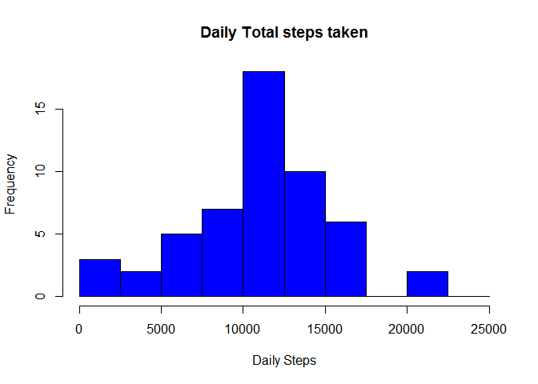
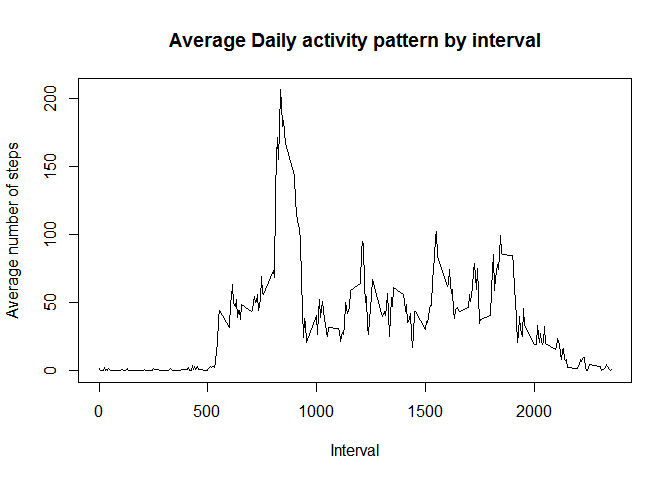
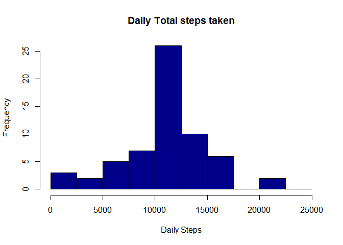

## Loading and preprocessing the data
###1. Code for reading in the dataset and/or processing the data

```r
library(dplyr)
```

```
## 
## Attaching package: 'dplyr'
```

```
## The following objects are masked from 'package:stats':
## 
##     filter, lag
```

```
## The following objects are masked from 'package:base':
## 
##     intersect, setdiff, setequal, union
```

```r
if (!file.exists("activity.csv")){
  unzip("activity.zip")
}

#Read all data  
dtAct <- read.csv("activity.csv", header = TRUE, sep = ",")

#Ignore NA values 
dtValAct <- subset(dtAct, !is.na(steps))
dtValAct$date <- as.Date(dtValAct$date,"%Y-%m-%d")
```


## What is mean total number of steps taken per day?
###2. Histogram of the total number of steps taken each day

```r
library(dplyr)

#Daily total steps
dlysum <- aggregate(steps~date, dtValAct, sum, na.rm=TRUE)

hist(dlysum$steps,
     col = "blue",
     xlab = "Daily Steps", 
     main = "Daily Total steps taken",
     breaks = seq(0,25000, by=2500))
```

<!-- -->

###3. Mean and median number of steps taken each day

```r
#Mean of the total number of steps taken per day:
mean(dlysum$steps)
```

```
## [1] 10766.19
```

```r
#Median of the total number of steps taken per day:
median(dlysum$steps)
```

```
## [1] 10765
```


## What is the average daily activity pattern?

```r
#Average steps by intervals
dlyActMean <- aggregate(steps ~ interval, dtValAct, mean)
names(dlyActMean) <- c("interval", "Mean")
```

###4. Time series plot of the average number of steps taken

```r
#plot for Average steps by intervals
with(dlyActMean, {
  plot(Mean~as.numeric(interval), type="l", xlab="Interval", 
       ylab="Average number of steps", main="Average Daily activity pattern by interval")
})
```

<!-- -->


##5. The 5-minute interval that, on average, contains the maximum number of steps

```r
maxMean <- dlyActMean[which.max(dlyActMean$Mean), ]$interval
maxMean
```

```
## [1] 835
```
The 5-minute interval that, on average, contains the maximum number of steps: 835

##6. Code to describe and show a strategy for imputing missing data

```r
# Imputing missing values

#Dataset dtAct contains all rows, replaces NA with mean value for day
#First count NA values
totNA <- sum(is.na(dtAct))
totNA
```

```
## [1] 2304
```

The total number of NAs i.e. missings values are: 2304


```r
#Function which will return the mean value for interval(parameter)
fnMeanStepsInterval<-function(pinterval){
    dlyActMean[dlyActMean$interval==pinterval,]$Mean
}

#Read through complete Dataset dtAct, and replace NA steps with mean value by calling function fnMeanStepsInterval

dlyActivity <- dtAct
for(i in 1:nrow(dlyActivity)){
    if(is.na(dlyActivity[i,]$steps)){
        dlyActivity[i,]$steps <- fnMeanStepsInterval(as.numeric(dlyActivity[i,]$interval))
    }
}
```
###7. Histogram of the total number of steps taken each day after missing values are imputed


```r
#Daily total steps after missing values are imputed
dlysum2 <- aggregate(steps~date, dlyActivity, sum, na.rm=TRUE)

hist(dlysum2$steps,
     col = "darkblue",
     xlab = "Daily Steps", 
     main = "Daily Total steps taken",
     breaks = seq(0,25000, by=2500))
```

<!-- -->

```r
#Mean of the total number of steps taken per day after imputtimg missing values:
mean(dlysum2$steps)
```

```
## [1] 10766.19
```

```r
#Median of the total number of steps taken per day after imputtimg missing values:
median(dlysum2$steps)
```

```
## [1] 10766.19
```

```r
#Mean value not changed, but there is change in median value after imputtimg missing values
```

## Are there differences in activity patterns between weekdays and weekends?
###7. Panel plot comparing the average number of steps taken per 5-minute interval across weekdays and weekends

```r
#Create a new factor variable in the dataset with two levels – “weekday” and “weekend” indicating whether a given date is a weekday or weekend day.

dlyActivity$date <- as.Date(dlyActivity$date,"%Y-%m-%d")
dlyActivity$day <- weekdays(dlyActivity$date)
dlyActivity$daytype <- ""

for(i in 1:nrow(dlyActivity)){
    if(dlyActivity[i,]$day %in% c("Saturday", "Sunday")){
        dlyActivity[i,]$daytype <- "weekend"
    }
    else
    {
        dlyActivity[i,]$daytype <- "weekday"
    }
}

DayTypeMean <- aggregate(dlyActivity$steps ~ dlyActivity$interval + dlyActivity$daytype, dlyActivity, mean)

names(DayTypeMean) <- c("interval", "daytype", "steps")

#Panel plot comparing the average number of steps taken per 5-minute interval across weekdays and weekends

library(lattice)
xyplot(steps ~ interval | daytype, DayTypeMean, type = "l", layout = c(1, 2), 
    xlab = "Interval", ylab = "Number of steps")
```

<!-- -->

```r
#Remove all datasets from memory

rm(dlyActivity, dlyActMean, dlysum, dlysum2)
rm(dtValAct, dtAct)
```
